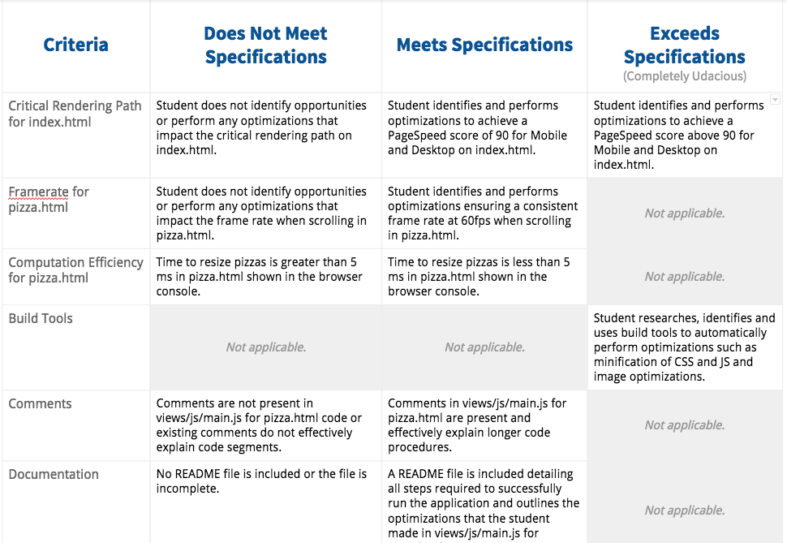

## Resources to optimize a website

[Effective optimizations for 60 FPS](https://github.com/udacity/fend-office-hours/tree/master/Web%20Optimization/Effective%20Optimizations%20for%2060%20FPS), by Udacity

<a href="https://www.youtube.com/watch?v=t8x40JXUeWA" target="_blank">
Dirty performance secrets of HTML5</a>

<a href="https://discussions.udacity.com/t/project-4-how-do-i-optimize-the-background-pizzas-for-loop/36302" target="_blank">
How to optimize the background pizzas</a>

----------------------------------------------------

### Evaluation rubric: 

